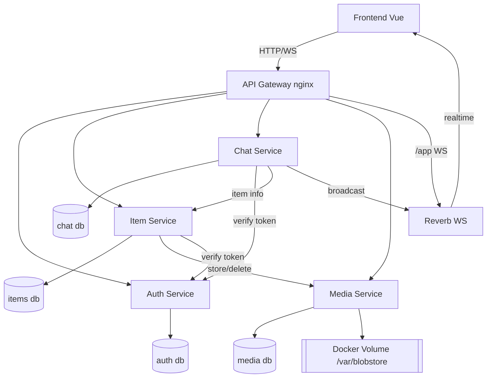
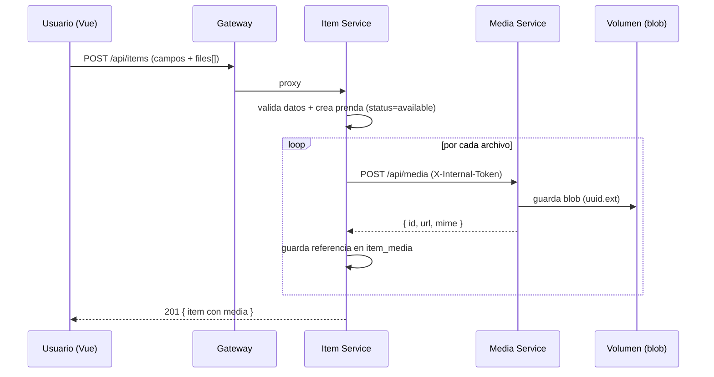
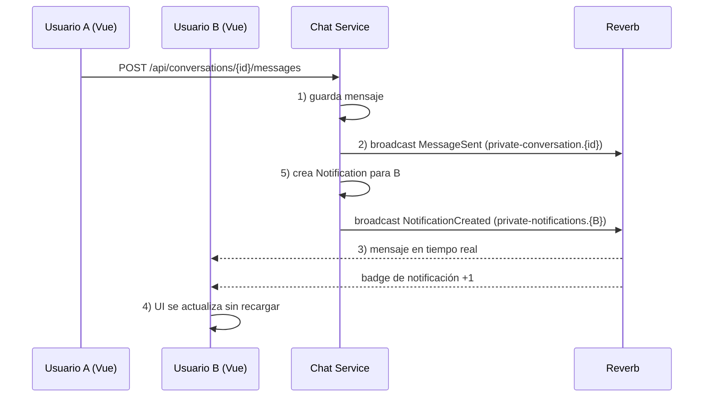

# Arquitectura

ReCloset es una **arquitectura distribuida de microservicios**. No existe backend monolítico: cada capacidad de negocio es un servicio independiente, desplegable y escalable por separado, con su propia base de datos.

## Microservicios y responsabilidades

| Servicio | Puerto interno | Base de datos | Responsabilidad |
|----------|----------------|---------------|-----------------|
| **auth-service** | 8000 | `recloset_auth` | Registro, login/logout, identidad, emisión y verificación de tokens (Sanctum), autorización base. |
| **item-service** | 8000 | `recloset_items` | CRUD de prendas, categorías/tallas/colores, precios, estados (disponible/reservada/vendida), catálogo público con filtros combinados, resumen del armario. Orquesta el almacenamiento multimedia. |
| **chat-service** | 8000 | `recloset_chat` | Conversaciones ligadas a una prenda, mensajes, difusión en tiempo real (Reverb) y **notificaciones**. |
| **media-service** | 8000 | `recloset_media` | Object/Blob storage autoalojado: subida, obtención, borrado, IDs únicos, metadatos, asociación con prendas. Único dueño del volumen físico. |
| **reverb** | 8080 | — | Servidor WebSocket (Laravel Reverb) para el transporte en tiempo real. |
| **gateway** | 80 | — | API Gateway (nginx): punto de entrada único y enrutado. |
| **frontend** | 5173 | — | SPA en Vue 3. |
| **prometheus** | 9090 | — | Observabilidad (única herramienta). |

## Comunicación entre servicios

Toda comunicación entre microservicios es **HTTP síncrono sobre la red interna de Docker/K8s**. Ningún servicio consulta la base de datos de otro.

```
Frontend ──HTTP──> Gateway ──HTTP──> {auth, item, chat, media}
item-service  ──HTTP (X-Internal-Token)──> media-service     (guardar / borrar archivos)
item-service  ──HTTP (Bearer)──────────── > auth-service     (introspección de token)
chat-service  ──HTTP (Bearer)──────────── > auth-service     (introspección de token)
chat-service  ──HTTP (X-Internal-Token)── > item-service     (datos de la prenda de una conversación)
chat-service  ──eventos──────────────────> reverb ──WS──> Frontend  (mensajes / notificaciones)
```

Dos mecanismos de confianza:

1. **Token de usuario (Sanctum, `Authorization: Bearer`)** — emitido por auth-service. Los demás servicios lo **introspeccionan** llamando a `GET /api/auth/verify` (patrón *Circuit Breaker + Retry*, con caché corta).
2. **Token de servicio (`X-Internal-Token`)** — secreto compartido para llamadas máquina-a-máquina (item→media, chat→item, lookups internos de auth). Nunca se expone al navegador.

## Diagrama de componentes (Mermaid)



## Flujo: crear una prenda con archivos



## Flujo: mensaje en tiempo real + notificación



## Seguridad

- **Contraseñas**: `bcrypt` vía cast `hashed` de Eloquent; jamás en texto plano.
- **Fortaleza de contraseña**: `Password::min(8)->mixedCase()->numbers()`.
- **Autenticación**: tokens Sanctum de larga duración; el navegador los guarda y los envía como `Bearer`.
- **Autorización**: cada endpoint privado comprueba propiedad (`owner_id === auth_user.id`) en el backend. El frontend nunca es la fuente de verdad.
- **Introspección de token**: los servicios no confían en el JWT del cliente a ciegas; validan contra auth-service.
- **Validación doble**: reglas en Vue (required, tipos) + reglas de Laravel (`$request->validate`).
- **Archivos**: se valida MIME **detectado por el servidor**, extensión derivada del MIME, tamaño máximo y se sanea el nombre.
- **Secretos**: `.env` (local) y `Secret` de Kubernetes; excluidos de git.
- **Errores**: respuestas JSON controladas (401/403/404/422) sin *stack traces* en producción (`APP_DEBUG=false`).
- **Inyección**: uso de Eloquent/consultas parametrizadas; sin SQL concatenado.
